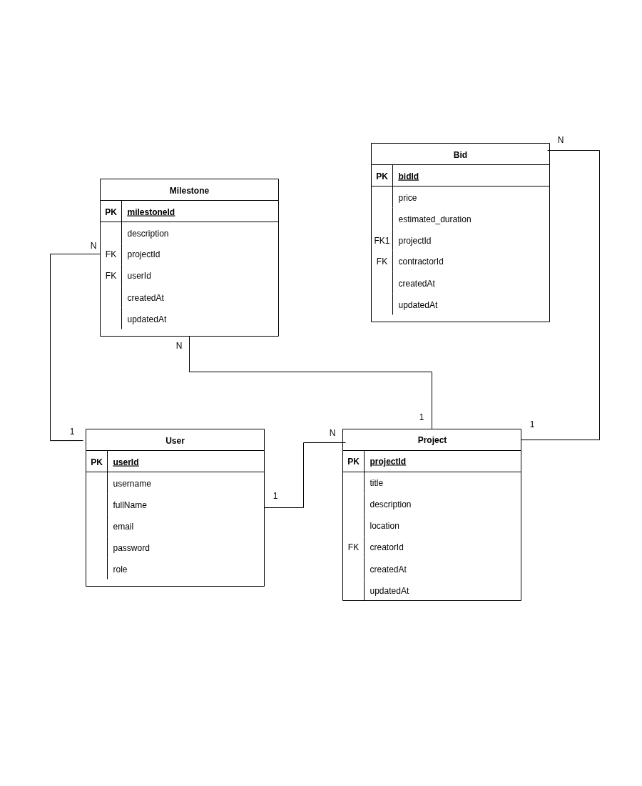

# Haven-API

A RESTful API for managing projects, bids, and milestones. Users can register, log in, create projects, bid on projects, and track project milestones.

## Table of Contents

* [Prerequisites](#prerequisites)
* [Installation](#installation)
* [Running the Project Locally](#running-the-project-locally)
* [API Endpoints](#api-endpoints)
* [Testing Endpoints](#testing-endpoints)
* [ER Model](#er-model)

---

## Prerequisites

Make sure you have the following installed:

* [Node.js](https://nodejs.org/) (v14 or higher)
* [npm](https://www.npmjs.com/) or [yarn](https://yarnpkg.com/)
* [Postman](https://www.postman.com/) (for testing endpoints)
* A database (e.g., PostgreSQL) configured in your **.env** file

---

## Installation

1. Clone the repository:

```bash
git clone https://github.com/furahaderick/roofline.git
cd roofline
```

2. Install dependencies:

```bash
npm install
# or
yarn install
```

3. Create a `.env` file in the root directory and add your environment variables:

```env
PORT=<PORT>
PG_DB_NAME=<DATABASE_NAME>
PG_USER=<DATABASE_USER>
PG_PWD=<DATABASE_PASSWORD>
JWT_SECRET=<JWT_SECRET>

```

---

## Running the Project Locally

Start the server:

```bash
npm run start:dev
# or
yarn start:dev
```

The server should now be running at:

```
http://localhost:3000
```

---

## API Endpoints

### Auth

* **Register**

`POST /auth/register`

Body (JSON):

```json
{
    "fullName": "Dukundane Furaha Yves Derick",
    "username": "furahayves",
    "email": "someemail@test.com",
    "role": "home-owner",
    "password": "passworld"
}
```

* **Login**

`POST /auth/login`

Body (JSON):

```json
{
    "email": "someemail@test.com",
    "password": "passworld"
}
```

---

### Projects

* **Create Project**

`POST /projects`

Authorization: Bearer Token

Body (JSON):

```json
{
    "title": "Zaria Court",
    "description": "Zaria Court is an urban lifestyle brand with a focus on sports, entertainment, and culture.",
    "location": "Remera, Rwanda"
}
```

* **Bid on Project**

`POST /projects/:projectId/bids`

Authorization: Bearer Token

Body (JSON):

```json
{
    "price": 2000,
    "estimated_duration": "8760:30:00"
}
```

* **Get All Projects**

`GET /projects`

Authorization: Bearer Token

* **Get Single Project**

`GET /projects/:projectId`

Authorization: Bearer Token

---

### Milestones

* **Mark Milestone**

`POST /projects/:projectId/milestones`

Authorization: Bearer Token

Body (JSON):

```json
{
    "description": "Open since 30th June, 2025"
}
```

* **Get Project Milestones**

`GET /projects/:projectId/milestones`

Authorization: Bearer Token

---

## Testing Endpoints

You can test the API endpoints using [Postman](https://www.postman.com/):

1. Copy requests from the Postman collection available [here](https://documenter.getpostman.com/view/46288786/2sB3BHkowC).
2. Use the `register` endpoint to create a user.
3. Log in to obtain the JWT token.
4. For protected routes (projects, bids, milestones), include the token in the `Authorization` header:

```
Authorization: Bearer <token>
```

---

## ER Model Diagram



---
